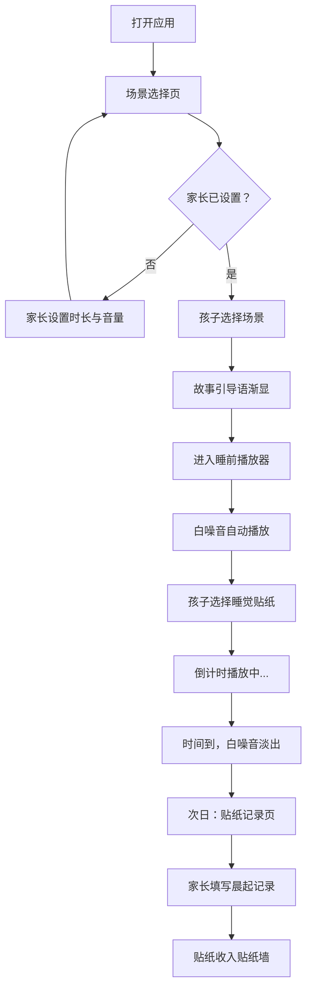

## 1. 产品概述

"晚安小旅人"是一款面向 4-8 岁儿童及陪睡家长的趣味睡前白噪音互动播放器。通过"今晚去哪里睡觉"的故事引导，将白噪音选择包装为场景探险，让孩子在温柔仪式感中自然入睡，同时帮助家长建立稳定的睡前流程。

- 核心目标：用故事化场景选择 + 白噪音播放 + 晨起贴纸激励，建立稳定的儿童入睡仪式
- 目标用户：4-8 岁儿童（主要操作者）+ 陪睡家长（设置与记录者）

## 2. 核心功能

### 2.1 用户角色

| 角色 | 进入方式 | 核心权限 |
|------|----------|----------|
| 小旅人（儿童） | 自动进入 | 挑选场景、选择睡觉贴纸、查看贴纸收集 |
| 守护者（家长） | 点击"家长设置"入口 | 设定播放时长、设定最大音量、填写晨起贴纸记录 |

### 2.2 功能模块

1. **场景选择页**：故事引导动画 + 三大场景入口 + 家长设置面板
2. **睡前播放器页**：场景氛围动画 + 白噪音播放控制 + 故事引导语 + 睡觉贴纸选择
3. **贴纸记录页**：晨起贴纸填写 + 历史贴纸墙 + 连续入睡天数统计

### 2.3 页面详情

| 页面名称 | 模块名称 | 功能描述 |
|----------|----------|----------|
| 场景选择页 | 故事开场 | 柔和动画展示"今晚去哪里睡觉？"标题，配以星光飘落效果 |
| 场景选择页 | 三大场景卡片 | 云朵帐篷、海边贝壳屋、森林小木屋三张可点击场景卡片，点击后展开场景预览动画 |
| 场景选择页 | 家长设置入口 | 右上角小齿轮图标，点击弹出家长设置面板（播放时长滑块 + 最大音量滑块） |
| 场景选择页 | 故事过渡 | 选择场景后，播放 2-3 句轻声引导语（文字渐显），如"放下小玩具，闭上眼睛，听听风的声音……" |
| 睡前播放器 | 场景氛围背景 | 全屏场景插画动画（云朵飘动/海浪起伏/萤火虫飞舞） |
| 睡前播放器 | 白噪音播放 | 自动播放对应场景白噪音组合，音量在家长设定范围内可微调 |
| 睡前播放器 | 播放倒计时 | 显示剩余播放时间，到时自动淡出停止 |
| 睡前播放器 | 睡觉贴纸选择 | 底部展示 4 枚可选贴纸（星星、月亮、小熊、绵羊），孩子选一枚"带去睡觉" |
| 睡前播放器 | 引导语提示 | 播放开始后每隔一段时间轻柔浮现引导文字提示 |
| 贴纸记录页 | 晨起贴纸填写 | 显示昨晚场景和所选贴纸，家长轻点两项："按时躺好了吗？"和"中途有没有喊人？" |
| 贴纸记录页 | 贴纸墙 | 展示近 7 天的贴纸收集，每天显示场景图标 + 贴纸 + 完成状态 |
| 贴纸记录页 | 连续入睡统计 | 显示"连续 N 天乖乖睡觉"的数字与星星进度条 |

## 3. 核心流程

### 3.1 睡前流程

1. 家长先点击齿轮图标，设定今晚播放时长（15/30/45/60 分钟）和最大音量
2. 孩子在场景选择页挑选一个场景
3. 系统播放 2-3 句故事引导语（文字渐显动画）
4. 进入播放器页，展示场景氛围，白噪音开始播放
5. 孩子从 4 枚贴纸中选一枚"带去睡觉"
6. 播放倒计时开始，到时自动淡出

### 3.2 晨起流程

1. 打开应用，进入贴纸记录页
2. 显示昨晚的记录卡片
3. 家长轻点确认"按时躺好"和"没有中途喊人"
4. 贴纸收入贴纸墙，连续天数更新

## 4. 用户界面设计

### 4.1 设计风格

- **主色调**：深靛蓝夜空色 (#1a1a3e) 作为基底，配合暖黄星光 (#ffd97d) 作为点缀
- **辅助色**：云朵场景用薰衣草紫 (#c4b5fd)，海边场景用薄荷蓝 (#7dd3fc)，森林场景用苔藓绿 (#86efac)
- **按钮风格**：大圆角（20px），柔和阴影，轻微弹性动画反馈，适合儿童点击
- **字体**：标题使用圆润可爱的手写风格字体，正文使用清晰易读的圆体
- **布局风格**：大卡片式，居中对称，留白充裕，避免信息过载
- **图标/Emoji 风格**：使用柔和手绘风格的场景插画，贴纸采用可爱卡通风格

### 4.2 页面设计概览

| 页面名称 | 模块名称 | UI 元素 |
|----------|----------|---------|
| 场景选择页 | 故事开场 | 深蓝夜空背景 + 飘落星光粒子动画 + "今晚去哪里睡觉？"大标题渐显 |
| 场景选择页 | 场景卡片 | 三张大圆角卡片横向排列，每张含场景插画缩略图 + 场景名 + 对应声音图标，hover 时轻微上浮与发光 |
| 场景选择页 | 家长设置 | 齿轮图标点击后从右侧滑入半透明面板，含时长选择按钮组 + 音量滑块 + 确认按钮 |
| 场景选择页 | 故事过渡 | 全屏渐暗后文字逐句淡入淡出，配以场景对应音效提示 |
| 睡前播放器 | 场景氛围 | 全屏场景插画（云朵/海浪/森林），持续缓慢动画循环 |
| 睡前播放器 | 播放控制 | 底部半透明控制栏：暂停/播放按钮 + 倒计时数字 + 音量微调滑块 |
| 睡前播放器 | 贴纸选择 | 底部弹出贴纸托盘，4 枚贴纸横向排列，选中后贴纸飞入场景中央 |
| 睡前播放器 | 引导语 | 场景上方居中半透明文字条，3-5 秒淡入后淡出 |
| 贴纸记录页 | 晨起记录 | 居中卡片显示昨晚场景 + 贴纸，下方两个大圆角按钮（笑脸/困脸） |
| 贴纸记录页 | 贴纸墙 | 7 天横向时间轴，每天一格，显示场景图标 + 贴纸 + 完成星星 |
| 贴纸记录页 | 连续统计 | 顶部大数字 "连续 N 天" + 星星进度条动画 |

### 4.3 响应式设计

- 桌面优先设计，主要在平板和桌面浏览器使用
- 移动端自适应：场景卡片纵向堆叠，控制栏保持底部固定
- 触控优化：所有可点击区域最小 48px，按钮间距充足

### 4.4 动效设计

- 页面切换：柔和淡入淡出，不使用突兀跳转
- 场景选择：卡片选中时发光 + 轻微缩放弹性动画
- 白噪音播放：背景持续缓慢动画（云飘/浪涌/萤飞）
- 贴纸选择：选中后贴纸弹跳飞入场景
- 引导语：文字逐字淡入，停留后整句淡出
- 倒计时结束：音量渐弱淡出，画面缓慢变暗
