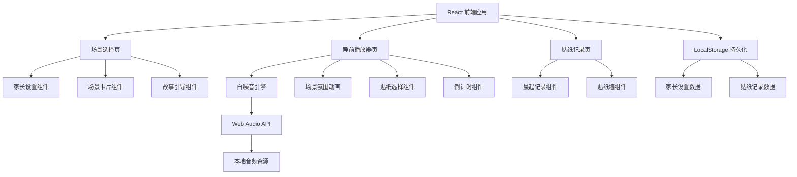
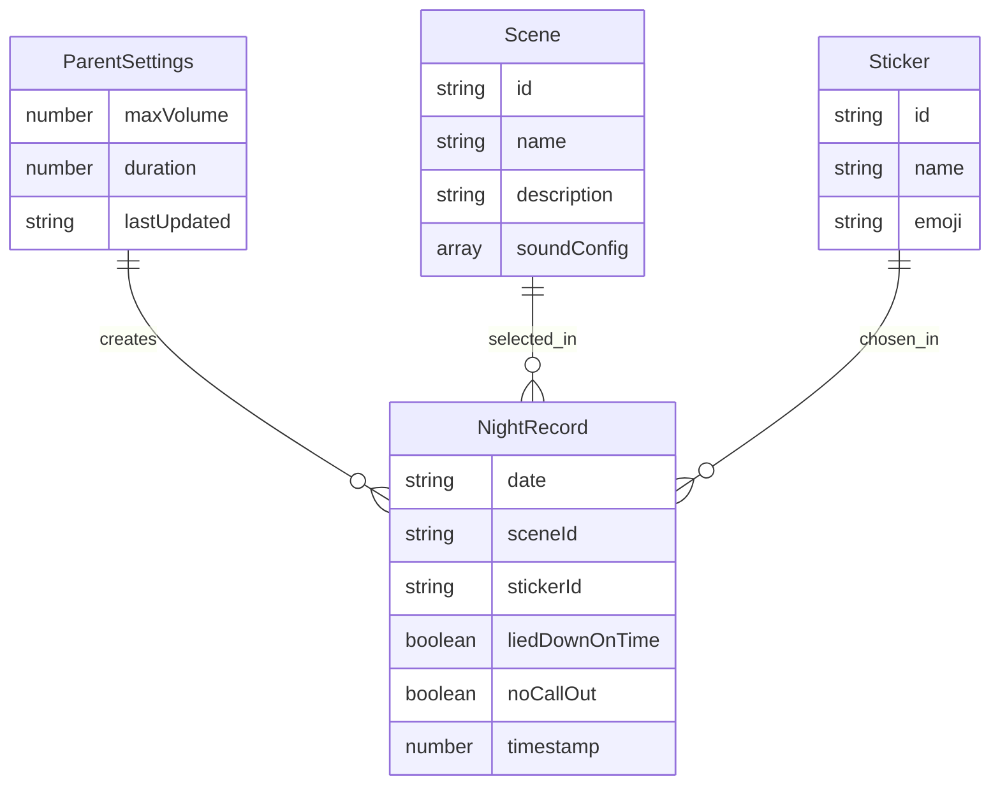

## 1. 架构设计



## 2. 技术说明

- **前端框架**：React 18 + TypeScript + Vite
- **样式方案**：Tailwind CSS 3
- **动画库**：Framer Motion（页面切换、卡片动画、贴纸飞入等）
- **音频引擎**：Web Audio API（白噪音合成与混合，无需外部音频文件）
  - 云朵帐篷：粉噪 + 低通滤波模拟风声
  - 海边贝壳屋：粉噪 + 振幅调制模拟海浪
  - 森林小木屋：高频粉噪切片模拟虫鸣 + 低频底噪
- **数据持久化**：LocalStorage（家长设置、贴纸记录、连续天数）
- **路由**：React Router v6
- **无后端服务**：所有数据和逻辑纯前端实现

## 3. 路由定义

| 路由 | 用途 |
|------|------|
| `/` | 场景选择页：故事开场 + 场景卡片 + 家长设置 |
| `/player/:sceneId` | 睡前播放器：场景氛围 + 白噪音 + 贴纸选择 |
| `/stickers` | 贴纸记录页：晨起记录 + 贴纸墙 + 连续统计 |

## 4. 数据模型

### 4.1 数据模型定义



### 4.2 数据定义

**LocalStorage 键值设计：**

```
goodnight_settings    → { maxVolume: 0.7, duration: 30, lastUpdated: "2026-06-16" }
goodnight_records     → [{ date: "2026-06-15", sceneId: "cloud", stickerId: "star", liedDownOnTime: true, noCallOut: false, timestamp: 1718467200000 }]
```

**场景配置数据（硬编码）：**

| 场景 ID | 名称 | 白噪音配置 |
|---------|------|------------|
| cloud | 云朵帐篷 | 粉噪 60% + 低通滤波风声 40% |
| seaside | 海边贝壳屋 | 粉噪 40% + 振幅调制海浪 60% |
| forest | 森林小木屋 | 高频粉噪虫鸣 30% + 低频底噪 70% |

**贴纸配置数据（硬编码）：**

| 贴纸 ID | 名称 | Emoji |
|---------|------|-------|
| star | 闪闪星 | ⭐ |
| moon | 弯弯月 | 🌙 |
| bear | 小熊 | 🧸 |
| sheep | 绵羊 | 🐑 |

## 5. 白噪音引擎设计

使用 Web Audio API 合成白噪音，无需加载外部音频文件：

1. **AudioContext**：全局音频上下文，页面切换时保持
2. **噪声生成**：通过 AudioBuffer 填充随机样本生成白噪音/粉噪音
3. **滤波器链**：BiquadFilterNode 组合实现风声、海浪、虫鸣效果
4. **增益控制**：GainNode 实现音量限制和淡入淡出
5. **混合输出**：多个音源通过 ChannelMergerNode 混合后输出

淡出逻辑：倒计时结束前 30 秒开始线性降低 GainNode 增益值，至 0 时断开连接。
